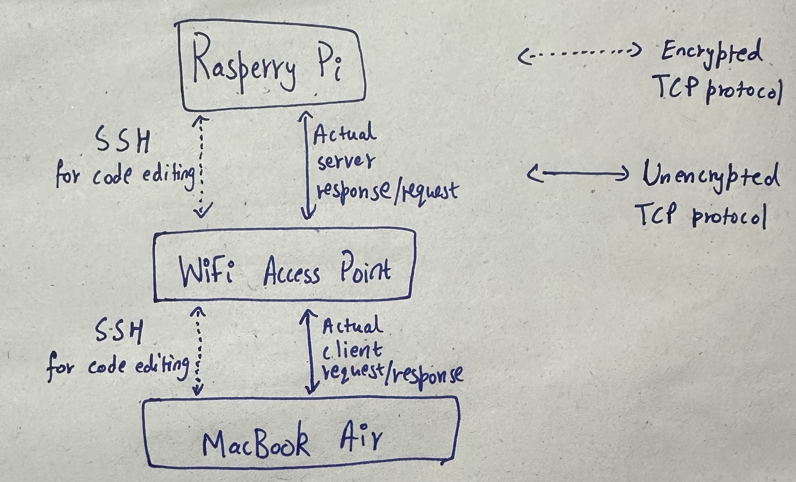
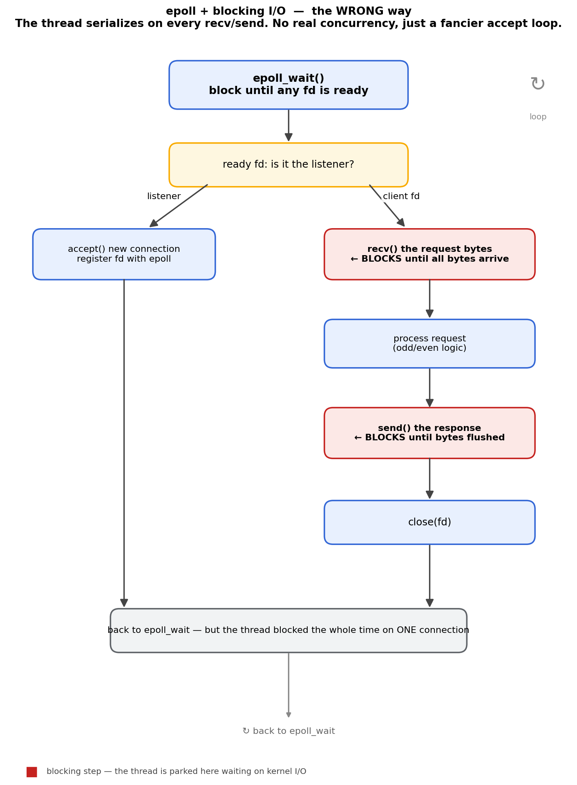
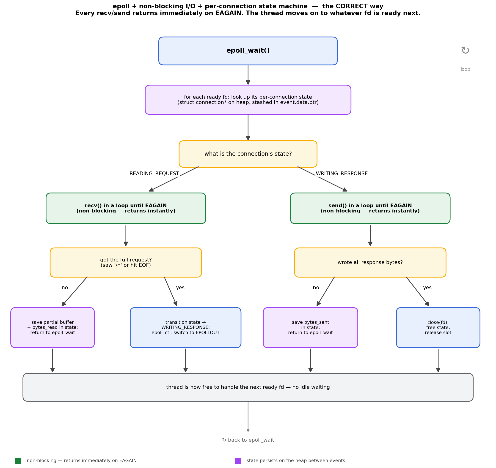

# The simple task of hosting an API


## Motivation

A few weeks ago, a friend of mine asked me "@Chai, do you have an idle server running that I can ssh into? I want to host an experimental server that people can query for a course project."

<!-- more -->

I was so mind-boggled with this question. Is this such a casual question to ask someone? Do students in this college just have idle servers running? Suppose I straight up gave access to my MacBook to host his server, how does one even create a server from scratch and serve others?

I played it off cool and said "Nah bro, I don't have a server right now" to which he just said "Cool, I'll just rent an AWS box then. There should be a free trial available".

This was the end of the conversation but it stuck with me for quite a while. As a grad student at Georgia Tech in CS, I should not be stumped by this simple question, so I decided to learn a little about networks and write this blog on "**the simple task of hosting an API**".

Also, my friend is joining a top tier trading firm in NYC. So maybe it is a casual question to ask for someone like him ¯\\\_(ツ)\_/¯


## Background

I used to work at Google as a SWE, and I always took infra work like hosting an API for granted. If I needed to expose a service to someone at Google, all I had to do was spin up a [Boq node](https://www.reddit.com/r/programming/comments/s21wti/comment/hsculqs/) (the internal microservice framework) and the boilerplate would be taken care of. I just needed to define the IO parameters, write the handler, and send the endpoint (provided by the internal load balancer) to my colleague who wanted the service.

Of course, it's only this simple for experimental work. For production-grade services an engineer has to ensure the protobufs match the client requirements (plus debugging hooks), add unit tests, regression tests, end-to-end tests, functional tests, load tests, analyse user behaviour, analyse system usage, and so on.

Joining Google Ads straight out of undergrad was an opportunity that I will forever be grateful for. I had immense growth both professionally and personally. I learnt a great deal of software engineering and how production code is supposed to be shipped at planet scale. So while I learnt a great deal about **using** planet-scale infra, I was severely lacking the experience of actually **building** it. I came away with a lot: strong software engineering habits, real fluency in writing documentation, deep domain knowledge of Ads, and good intuition for how users and advertisers actually behave. What I didn't come away with was experience on the deep technical layer like improving the load balancer, shaving boot-time latency off Borg machines, that kind of work.

So I came back to academia. Case in point, here is a [blog post](https://mishal23.github.io/back-to-academia/) from another Google engineer (and friend) about going back to academia. We share the same sentiment but reached different conclusions. He chose to stay at Google and pursue an online master's from Georgia Tech part-time. I chose to leave Google and pursue an in-person master's degree from Georgia Tech full-time. Note to the reader: there is no right/wrong answer in our decisions here.

## Hardware

The easiest solution was to input my credit card into one of the cloud providers (AWS/GCP/Oracle) and get an instance of one of their machines that I can SSH into. Basically what my friend ended up doing. But I don't want to do that for several reasons.

So what I'm going to do is use my fully decked-out Raspberry Pi 5 that has been sitting idle in my closet for the past 3 years. This Pi comes with a cooling fan, 128 GB SD storage, a 2.4 GHz quad-core Arm Cortex-A76, and 8 GB RAM, running the Linux-based Raspberry Pi OS.

Looks something like this before assembling:


This is the machine that will be hosting my server. I will be using my MacBook M1 Air as the client to query it.

## Setup

### Big picture



As mentioned before, I will be using my Pi as the server and I will be editing the Pi's files on my Mac via SSH. My Mac will also act as the client that pings the server. So there are two paths from my Mac to the Pi.

One thing to note is that my ISP doesn't provide a global static IP address. So for now I can only access this server from **devices connected to my Wi-Fi**. If I wanted to host it on the open internet, I would also need to disable my firewall and expose ports. I am smart enough to know that I'm not yet skilled enough in cybersecurity to play with these configurations, so I shall not venture there yet.

Before running the server, we need to get the machine running first. The Canakit version I bought comes with Raspberry Pi OS pre-loaded, so I really don't have to do anything here. All I need to do is turn it on and enable SSH on it.

```bash
raspberrypi:~ $ sudo systemctl enable --now ssh
```

And now I SSH into the machine from my Mac.

```zsh
MacBook-Air ~ % ssh chaithu@raspberrypi.local
```

Wait, I can just type `chaithu@raspberrypi.local` instead of an IP address?

### mDNS

IP addresses provided by my Wi-Fi access point are not really static. The DHCP server in my home router hands out a lease that typically expires every 24 hours, and clients renew it (usually getting the same IP back, but not guaranteed). The IP can change when the lease expires while the device is off, when the router reboots, or when DHCP gets confused. Even though it's a slow refresh, it's a bit of a pain to find out the Pi's IP address each time, so I just use **mDNS**. I'm sure nothing can go wrong with this simple hack. (_subtle foreshadowing_)

mDNS is a really neat protocol for resolving hostnames to IP addresses of devices in a local network. Basically my Mac sends a multicast query to all the devices in my network. My Pi sees this call and responds with a similar multicast packet containing the IP address it owns.

```zsh
MacBook-Air ~ % ping -q -c 10 raspberrypi.local
PING raspberrypi.local (192.168.1.24): 56 data bytes

--- raspberrypi.local ping statistics ---
10 packets transmitted, 10 packets received, 0.0% packet loss
round-trip min/avg/max/stddev = 16.264/30.368/52.540/12.168 ms
```

We can see that `raspberrypi.local` resolves to `192.168.1.24` and a ping takes ~30 ms on average.

### 1. Server Code

Now this is the most fun part! Writing the code for the server. For maximum learning I decided to use C++. I would use pure C, but multithreading in C is an absolute pain and I would much rather deal with `std::thread` if I needed it. As it turns out, I didn't end up using multithreading at all.

Let's start with a very simple bare-bones server. I won't explain most of the code since it's basic stuff. I highly recommend reading the [Beej networking guide](https://beej.us/guide/bgnet/) to learn the basics. It's a really good tutorial after which I went from 0 to a basic socket programmer that can understand the man pages of the network syscalls.

```cpp
#include <iostream>
#include <sys/types.h>
#include <sys/socket.h>
#include <netdb.h>
#include <cassert>
#include <arpa/inet.h>
#include <unistd.h>

void set_socket_to_listen(int s){
    struct sockaddr_in addr;
    addr.sin_family      = AF_INET; // use IPv4 or IPv6
    addr.sin_port        = htons(8080); // set port 8080
    addr.sin_addr.s_addr = htonl(INADDR_ANY);   // set wildcard matching on IP address.
    // This means that the kernel will listen to all IP addresses that this machine owns.

    int yes = 1;
    setsockopt(s, SOL_SOCKET, SO_REUSEADDR, &yes, sizeof yes); // free the socket if its being used by someone else.

    int b = bind(s, (struct sockaddr*)&addr, sizeof addr);
    if (b < 0) { perror("bind"); exit(1); }

    int l = listen(s, 1); // accept atmost 1 connection into the queue. Drop the rest.
    if (l < 0) { perror("listen"); exit(1); }
}

int accept_from_queue_and_return_fd(int s){
    struct sockaddr_storage their_addr;
    socklen_t addr_size = sizeof their_addr;
    return accept(s, (struct sockaddr*)&their_addr, &addr_size);
}

ssize_t perform_logic_and_populate_response(const char *req_buf, int req_size, char *res_buf, int res_size){
    int num = atoi(req_buf); // atoi will default to 0 on bad char*.

    if(num <= 0) return snprintf(res_buf, res_size, "Invalid\n");
    if(num & 1) return snprintf(res_buf, res_size, "Odd\n");
    else return snprintf(res_buf, res_size, "Even\n");
}

int main(){
    // INITIALIZE A SOCKET.
    int s = socket(AF_INET, SOCK_STREAM, 0);
    if (s < 0) { perror("socket"); return 1; }

    // SETUP THE SOCKET TO LISTEN FOR TCP connections.
    set_socket_to_listen(s);

    while(true){
        // ESTABLISH CONNECTION.
        int fd = accept_from_queue_and_return_fd(s);
        if(fd < 0) continue; // failed to establish connection.

        char req_buf[20], res_buf[20];

        // RECEIVE REQUEST
        ssize_t num_bytes_read = recv(fd, req_buf, sizeof req_buf - 1, 0);
        if(num_bytes_read <= 0){
            close(fd);
            continue; // failed to recieve a request.
        }
        req_buf[num_bytes_read] = '\0';

        // PERFORM LOGIC.
        ssize_t num_bytes_written = perform_logic_and_populate_response(req_buf, num_bytes_read, res_buf, sizeof res_buf);

        // SEND RESPONSE.
        ssize_t num_bytes_sent = send(fd, res_buf, num_bytes_written, 0);

        // CLOSE CONNECTION.
        close(fd); // close the connection.
    }

    return 0;
}
```

Some things to note:

- The server runs on port 8080.
- The server accepts at most 1 connection in its queue, as seen in the `listen()` call.
- The API just returns whether the given number is Odd or Even, with some basic error handling.

Let's run it on my Pi:

```bash
raspberrypi:~/Desktop/server $ g++ single_thread.cpp -o server && ./server
```

And on my Mac I query the server:

```zsh
MacBook-Air ~ % echo "100" | nc raspberrypi.local 8080
Even
```

Absolute success! Most of this is basic boilerplate. if you want to change the API, the only thing that needs to change is the `perform_logic_and_populate_response` function.

Also, notice that this communication is completely unencrypted (you might have spotted this in my diagram). Anyone inside my Wi-Fi network can snoop around and intercept these bytes with a simple `tcpdump` command.

## Stress test

Sure, technically this is a valid server API that people can now query. But how good is it? How good can we make it? What does "good" even mean?

There are many measures of what a good server should be. You can optimise for metrics like:

- **Throughput**: how many queries can the server respond to?
- **Latency**: how long does each response take?
- **Reliability**: does the server have any downtime?
- CPU usage
- Memory usage
- etc.

For now, I only care about throughput and latency. This setup is pretty bad reliability-wise because it's literally one machine that could go off at any time. CPU and memory are physical limitations I can't really change.

### Baseline

I asked Claude to make a stress test script in Python. With this I can drive the server at any QPS schedule I want and measure the success rate and per-request latencies. You can find the script on my GitHub [here](https://github.com/Dragonado/IPServer/blob/main/stress.py).

The setup that gives me the most informative single test is a **staircase load**: 10 plateaus at 10, 60, 110, 160, 210, 260, 310, 360, 410, 460 QPS, each plateau held for 10 seconds. That is **23,500 total attempts** in a ~100-second run, sweeping from "everything will succeed" through the server's knee and into the saturation zone.

A couple of things that broke while I was doing stress testing:

- **mDNS fails under load**: mDNS resolution under load drops 6–11% of lookups because the kernel cannot resolve this many requests this fast even though its cached. These errors which would show up as client errors and contaminate the server measurements. So I just use the fixed IP address given by my wifi AP which looks something like `192.168.1.13:8080`.
- **file descriptor limit.** macOS defaults to 256 open files (since everything is a file in Unix, even connections are considered files). The python stress script opens connections far faster than they tear down, so I run `ulimit -n 65536` in the shell first. Without this, the stress test starts returning `EMFILE` error and the failures look like server bugs.

Before the full staircase, a quick sanity check at 10 QPS for 5 seconds to confirm the binary is alive:

```zsh
(.venv) MacBook-Air IPServer % python3 stress.py --host raspberrypi.local --qps 10 --warmup 1 --steady 5

[client] target raspberrypi.local:8080  qps=10  warmup=1.0s  steady=5.0s  timeout=15.0s
[client] expected attempts: ~5 (warmup) + 50 (steady) = 55
[client] log: stress_log.jsonl
[client] schedule: 5 warmup + 50 steady = 55 total
[client] query mode: varying — payload = 1 + (rid-1) % 1000, expected = Odd/Even per parity
[client] issued 55 requests in 5.90s (target 6s); awaiting in-flight...
[client] all in-flight complete at 6.59s
[client] wrote 55 records to stress_log.jsonl

=== Warmup phase (n=5) ===
  Correct  :       5  (100.0%)
  Wrong    :       0  (  0.0%)
  Errors   :       0  (  0.0%)
    ok                                                                 5  (100.0%)

=== Steady phase (n=50) ===
  Correct  :      50  (100.0%)
  Wrong    :       0  (  0.0%)
  Errors   :       0  (  0.0%)
    ok                                                                50  (100.0%)

=== Latency — steady phase, anchored to t_scheduled (n=50) ===
metric                                   count       min       avg       p50       p90       p99     p99.9       max
connect_ms  (scheduled -> connected)        50   114.124   230.030   187.249   398.705   642.742   685.527   690.281
ttfb_ms     (scheduled -> 1st byte)         50   135.634   299.521   211.728   589.575   930.229   974.246   979.137
total_ms    (scheduled -> close)            50   135.743   320.891   211.909   689.777  1121.291  1201.245  1210.129
queue_ms    (scheduled -> start)            50     0.142     1.170     1.239     1.440     2.386     2.707     2.743

  queue_ms is the client-side delay: how late the coroutine started vs its
  scheduled time. Should be ~0 when not saturated; growing means coordination
  omission is happening and tail latencies are real (not artifacts).

Achieved issue rate (steady phase): 10.2 q/s over 4.90s
[client] wrote chart to stress_chart.png
```

Looks like the server is alive. Average end-to-end latency is around 320 ms and p99 is around 1.1 s for this tiny 50-request sample. 

!!! info "What these latency numbers actually measure"
    They are almost entirely network and socket handling, not the API itself. The code inside the `while` loop receives ~20 bytes, runs a couple of branches (odd vs even), and sends ~20 bytes back. That's microseconds of work. Every millisecond you see in the table above is TCP handshake, Wi-Fi airtime, kernel scheduling, and teardown.

The sanity check only exercises the bottom step of the staircase — 10 QPS, where the server is comfortable. The real question is what happens as we climb. Time for the full staircase against the same `single_thread` server (source: [`1_single_thread.cpp`](https://github.com/Dragonado/IPServer/blob/main/1_single_thread.cpp)):


The numbers are grim. Out of 23,500 attempts, **only 155 succeed (0.7%)**. The server holds 100% success at 10 QPS (p50 92 ms, p99 776 ms) and then falls off a cliff: 91% errors at 60 QPS, 100% errors from 110 QPS onward. Most failures are timeouts, with a third showing up as connection-refused.

Something is clearly broken. A Pi 5 should not collapse at 60 QPS. Time to figure out why.

### Optimisations

#### 2. Increasing the Accept Queue size because someone attacked my server

##### The attack

Before I dig into the staircase collapse, here is how I actually first noticed something was wrong. The staircase chart is the polished retrospective. What actually happened, chronologically, was something even more stupid: out of curiosity I reran the small 10 QPS sanity check from before and now even *that* failed completely with 0% of queries succeeding.

```zsh
(.venv) MacBook-Air IPServer % python3 stress.py --host raspberrypi.local --qps 10 --warmup 1 --steady 1

[client] target raspberrypi.local:8080  qps=10  warmup=1.0s  steady=1.0s  timeout=15.0s
[client] expected attempts: ~5 (warmup) + 10 (steady) = 15

=== Warmup phase (n=5) ===
  Correct  :       0  (  0.0%)
  Wrong    :       0  (  0.0%)
  Errors   :       5  (100.0%)
    timeout                                                            5  (100.0%)

=== Steady phase (n=10) ===
  Correct  :       0  (  0.0%)
  Wrong    :       0  (  0.0%)
  Errors   :      10  (100.0%)
    timeout                                                           10  (100.0%)
```

Whaaaaat? Why is everything failing? My Pi is working completely fine and there was no downtime. The server is still running, I literally queried it a bunch of times just before running this stress test. I haven't rebuilt the binary or anything. And I'm only running a small 10 QPS stress test, so it's not a performance issue. Yet every query times out.

##### The analysis

It's a not-so-popular cybersecurity attack that I triggered accidentally with my bad socket configuration. Not DDoS, but close. Do you want to guess what?

??? question "What was it? (click to reveal)"
    

    It's the [Slowloris attack](https://en.wikipedia.org/wiki/Slowloris_(cyber_attack)) or more technically, a Slowloris-*like* attack, since classic Slowloris works on HTTP requests whereas my issue is at the TCP layer.

It's a type of [slow DoS attack](https://en.wikipedia.org/wiki/Slow_DoS_attack) where a malicious actor causes the service to become unavailable by sending partial requests that hold the connection alive and starve the server's connection capacity. Mine wasn't malicious though, it was accidental.

??? question "What happened? (click to reveal)"
    My current implementation tells the kernel to only keep an accept queue of size `1` (`listen(fd, 1)`). Any connections arriving after the queue is full are silently dropped by the kernel. My server has a full queue and is unable to accept any more requests.

!!! question "Why did this happen?"
    Why is the queue full, though? Shouldn't my server just `accept()` the connection, serve it, and free the queue?

    Because my beautiful single-threaded program is stuck inside the blocking `recv()` call and cannot move on. I mentioned that I ran a bunch of queries before this one and I didn't rebuild the binary, right? Turns out one of those queries didn't behave correctly.

It looks like one of the earlier queries established a connection with my Pi but never sent its request bytes (Wi-Fi packet loss, most likely since it happens a lot). My Pi is keeping the connection alive in hopes of getting the request back. That's the Slowloris-like attack that happened to me (by me :'( ).

!!! warning "TCP keep-alive doesn't save you here"
    [TCP keep-alive](https://tldp.org/HOWTO/TCP-Keepalive-HOWTO/overview.html) is **off by default**, so the server is held hostage forever by one lost packet. While turning on TCP keep-alive would eventually clean up connections lost to packet loss, a malicious actor could still bypass it.

I would have had a very hard time debugging this flaky issue without Claude. It gave me a bunch of things to try, and I was able to confirm the diagnosis using the `ss` (socket statistics) command to inspect the active socket connections on port `8080`.

The proper fix is to make `recv` non-blocking via the `epoll` syscall. With `epoll` I can choose to only handle connections that actually have data.

This is also exactly what made the staircase chart above so brutal: at 60+ QPS the accept queue (size 1) overflows almost instantly, and once anything blocks in `recv` the queue stays full.

##### The (temporary) fix
Workaround for now:

- Kill the server.
- Increase the queue size to the system maximum (`4096` on my Pi, set by `/proc/sys/net/core/somaxconn`).
- Set a timeout on the `recv()` syscall via `SO_RCVTIMEO` (stopgap instead of `epoll`).
- Rebuild the binary.
- Start the server again.

Increasing the accept queue size increases the throughput of the server because we can answer more queries by queuing them instead of dropping them. However, it doesn't change the number of queries we can respond to **per second**, because we aren't any faster per request. The queue is a shock absorber, not a speed-up.

Here is the staircase against this patched server (source: [`2_single_thread_max_queue.cpp`](https://github.com/Dragonado/IPServer/blob/main/2_single_thread_max_queue.cpp)):


The same code with one integer changed (`listen(s, 1)` → `listen(s, 4096)`) goes from **0.7% to 24.1% overall success**: 5,675 / 23,500 succeed. At 10 QPS the p50 drops to **58 ms** (vs. 92 ms on server 1). It now holds 100% success all the way through 160 QPS, where p50 is around 68 ms and p99 around 415 ms. The knee is at ~210 QPS, and by 260 QPS everything times out again.

!!! tip "Lesson: `listen(s, N)` is the most important number you set on the listener"
    Going from `backlog=1` to `backlog=4096` bought roughly **16× more sustainable QPS**. Backlog isn't speed but it's burst tolerance. With a tiny backlog, one slow handler or a momentary kernel hiccup instantly fills the queue and the kernel starts dropping SYNs. With a large backlog, the kernel can absorb thousands of pending connections while userspace drains.

To make our server answer more queries per second, we have to introduce non-blocking I/O. Right now the thread sits idle inside `recv` waiting for one particular connection's bytes, even when other connections already have their bytes sitting in the kernel buffer, ready to be served.

#### Epoll

`epoll` is Linux's mechanism for asking the kernel "here is a bunch of file descriptors I care about, wake me when *any* of them have something I can do."

There are two ways to use `epoll`, and the difference is more important than it looks.

##### 3. Epoll + blocking I/O

My first version of the epoll server was me trying to code it after reading the official epoll documentation. Full source: [`3_epoll_single_blocking_io.cpp`](https://github.com/Dragonado/IPServer/blob/main/3_epoll_single_blocking_io.cpp).


```cpp
int main(){
    // INITIALIZE A SOCKET.
    int s_fd = socket(AF_INET, SOCK_STREAM, 0); 
    if (s_fd < 0) { perror("socket"); return 1; }

    // SETUP THE SOCKET TO LISTEN FOR TCP connections.
    set_socket_and_listen(s_fd);

    #define MAX_EPOLL_EVENTS 100
    struct epoll_event events[MAX_EPOLL_EVENTS];

    // Create Epoll file descriptor.
    int ep_fd = epoll_create1(0);

    // Default event.
    struct epoll_event ev;
    ev.events = EPOLLIN;
    ev.data.fd = s_fd;

    if(epoll_ctl(ep_fd, EPOLL_CTL_ADD, s_fd, &ev) < 0){
        perror("epoll");
        return 1;
    }

    while(true){
        // ESTABLISH CONNECTION.
        int num_active_conn = epoll_wait(ep_fd, events, MAX_EPOLL_EVENTS, 1 * 1000);

        for(int i = 0; i < num_active_conn; i++){ 
            if(events[i].data.fd == s_fd){
                int conn_fd = accept_from_queue_and_return_fd(s_fd);
                if(conn_fd < 0) continue; // failed to establish connection.
                
                ev.events = EPOLLIN;
                ev.data.fd = conn_fd;
                if (epoll_ctl(ep_fd, EPOLL_CTL_ADD, conn_fd, &ev) == -1) {
                    perror("epoll_ctl: conn_sock");
                    exit(EXIT_FAILURE);
                }
                struct timeval tv = {2, 0};
                setsockopt(conn_fd, SOL_SOCKET, SO_RCVTIMEO, &tv, sizeof(tv));  // set a timeout of 2s per recv call. 
            }
            else{
                int conn_fd = events[i].data.fd;
                if (events[i].events & (EPOLLERR | EPOLLHUP)) { close(conn_fd); continue; }

                char req_buf[20], res_buf[20];

                // RECEIVE REQUEST
                ssize_t num_bytes_read = recv(conn_fd, req_buf, sizeof req_buf - 1, 0);
                if(num_bytes_read <= 0){
                    close(conn_fd);
                    continue; // failed to recieve a request.
                }
                req_buf[num_bytes_read] = '\0';

                // PERFORM LOGIC.
                ssize_t num_bytes_written = perform_logic_and_populate_response(req_buf, num_bytes_read, res_buf, sizeof res_buf);

                // SEND RESPONSE.
                ssize_t num_bytes_sent = send(conn_fd, res_buf, num_bytes_written, 0);
                
                // CLOSE CONNECTION.
                close(conn_fd); // close the connection.
            }
        }
    }

    return 0;
}
```
Looks good! Yes, I'm technically using epoll and the code should run correctly, but something looks sus. It can't be that easy to make it concurrent right?

??? question "Is this actually concurrent? (click to reveal)"
    Absolutely not. If you look closely, I'm still fully blocked on `recv` and `send`. My single thread sits idle until `recv` has received all the bytes for that one connection. So I'm interacting with exactly one connection at a time, from start to finish. This is **NOT** concurrency.

What I just did:

- Get a ready file descriptor from `epoll_wait`.
- Open or read the connection.
- Block on `recv` until the full request arrives.
- Process and block on `send`.
- Close the connection.
- Repeat.

This is hilariously wrong. I'm literally crying dawg :cry:, this is exactly what I was doing with server 2 but now with more overhead because I'm using a fancy connection selection algorithm from the queue.




!!! danger "Anti-pattern: epoll wrapper around a blocking handler"
    This pattern *looks* like high-performance event-driven concurrency, but the actual behaviour is identical to a single-threaded blocking loop. You pay the extra cost of `epoll_wait` + `epoll_ctl` syscalls and get nothing back. Always pair `epoll` with non-blocking I/O and per-connection state otherwise you've just made the "one connection at a time, serially" server.


The numbers confirm it. This server compiles, runs, and sustains **~160 QPS at 100% success** with the knee at ~210 QPS which is exactly the same as server 2. The latency is measurably *worse*, though: p50 at 160 QPS jumps from 68 ms (server 2) to 267 ms here, because every event now pays the extra `epoll_wait` round-trip and a redundant `setsockopt(SO_RCVTIMEO)` per accept.

This is what I *should* be doing with `epoll`:

- Get a ready file descriptor (fd) from `epoll_wait`.
- Look up the per-connection state.
- Do as much work as possible without blocking: `recv` until `EAGAIN`, parse if I can, `send` until `EAGAIN`.
- The moment the kernel says "no more bytes right now," save the connection's state and return to `epoll_wait`.
- The thread is now free to work on whatever other fd is ready.
- When the kernel later signals the same fd is ready again, resume the state machine where it left off.
- When the response is fully sent, close the fd and free the state.



The correct usage lets me save the state of a connection, make partial progress, and work on other connections instead of sitting idle. That's where the real concurrency gains live.

[TBA: add better flowcharts].


##### 4. Epoll + non-blocking I/O

The proper version puts every file descriptor into non-blocking mode via `fcntl(fd, F_SETFL, O_NONBLOCK)` and refactors the connection handler into a **state machine** that lives on the heap, keyed by the file descriptor. Each connection owns a struct with its read buffer, write buffer, byte counters, and current state (`READING_REQUEST` vs `WRITING_RESPONSE`). Source: [`4_epoll_single_non_blocking_io.cpp`](https://github.com/Dragonado/IPServer/blob/main/4_epoll_single_non_blocking_io.cpp).

The flow becomes:

1. `epoll_wait` returns "fd X has an event".
2. Look up the per-connection state via `data.ptr` (the kernel hands you back whatever pointer you stashed when you registered the fd).
3. Do whatever work is possible right now: 
    - If reading then `recv` bytes as much as possible or until you see a newline.
    - If writing then `send` bytes as much as possible or until you're finished. 
4. When the kernel has more to tell us about this fd, `epoll_wait` returns it again and we resume the state machine where we left off.
5. The thread is now free to handle other connections.

!!! note "The key insight"
    Notice that the CPU still runs serially with a single thread, but this time the *waiting* now happens in parallel across connections.

This version sustains **~210 QPS at 100% success**, with the knee around 260 QPS which is about **25–30% more sustainable throughput than the well-tuned blocking server (server 2)**. The latency gap shows up exactly where you'd expect: at 210 QPS server 4 holds p50 109 ms with 100% success, while server 2 is already at 15% failure with p50 175 ms and a long tail.

At the very bottom of the staircase, this server's p50 at 10 QPS is **53 ms** — which is going to matter in the next section, because that number turns out to be quite close to the theoretical Wi-Fi RTT floor.


#### Bottleneck is Wi-Fi 

[TBA: I suspect we are optimal in code but limited by the technology of our hardware.=]

## Latency optimisations

If the network is the limit, the only way to reduce latency is to change the network or change the protocol. Here are some things that I didn't try but I imagine would work:

- **Use bare IP instead of mDNS**: A cached mDNS query takes only a few milliseconds but a fresh call will cost you a second or two. Doesn't apply here anyway since I was using bareIP but good to know.
- **Move to 5 GHz Wi-Fi if you're on 2.4 GHz.** Lower latency, much lower variance. Since use 5 GHz has a shorter range, I was on 2.4GHz in my experiment because my laptop was in a different room than the access point.
- **Move closer to the access point.** Taking this straight from the HFT playbook lol.
- **Switch to Ethernet**: This is probably biggest possible win. Gigabit Ethernet has sub-millisecond RTT and ~10,000× the small-packet PPS budget of typical Wi-Fi. The 50 ms p50 latency would drop to ~1 ms.
- **Persistent connections**: Right now we open a new TCP connection per request, paying ~3 RTTs of handshake/teardown overhead for every single response. If clients reused one connection for many requests (HTTP keep-alive style), we'd amortise that cost to near zero. But this is a client side protocol change, not a network change.


!!! warning "Anti-pattern: scaling the wrong dimension"
    One would think that the obvious next step on a 4-core Pi is to use all 4 cores. However, on **Wi-Fi**, it would do nothing — the radio is shared by all processes on the machine, so adding cores doesn't increase the PPS the radio can deliver. Plug in an Ethernet cable first, *then* think about multiple processes. Always identify the binding constraint before deploying more cores.


I have a very smart friend who works for a HFT firm back in India. His job literally involves shaving off picoseconds whereas I'm trying to save on milliseconds. Maybe I can ask him for some tips on what else I can do here.

## Conclusion

What I set out to build was an API my friend could hit from his laptop. What I actually built was a ~210-QPS odd-or-even oracle on a Pi in my closet and a deep non-trivial appreciation for how much of the modern internet's complexity exists.

The four servers map cleanly to four discrete architectural steps, and each one bought a different kind of improvement:

| # | Server | Source | Sustainable QPS (100% success) | Knee QPS (~50% success) | Total OK / 23,500 | p50 @ 10 QPS |
|---|---|---|---|---|---|---|
| 1 | `single_thread` (backlog = 1) | [`1_single_thread.cpp`](https://github.com/Dragonado/IPServer/blob/main/1_single_thread.cpp) | 10 | ~10 | 155 (0.7%) | 92 ms |
| 2 | `single_thread_max_queue` (backlog = 4096) | [`2_single_thread_max_queue.cpp`](https://github.com/Dragonado/IPServer/blob/main/2_single_thread_max_queue.cpp) | 160 | ~210 | 5,675 (24.1%) | 58 ms |
| 3 | `epoll_blocking_io` | [`3_epoll_single_blocking_io.cpp`](https://github.com/Dragonado/IPServer/blob/main/3_epoll_single_blocking_io.cpp) | 160 | ~210 | 6,601 (28.1%) | 86 ms |
| 4 | `epoll_non_blocking_io` | [`4_epoll_single_non_blocking_io.cpp`](https://github.com/Dragonado/IPServer/blob/main/4_epoll_single_non_blocking_io.cpp) | 210 | ~260 | 11,408 (48.5%) | 53 ms |

The single biggest win was changing one integer (`listen(s, 1)` → `listen(s, 4096)`). epoll without non-blocking I/O was a wash. The full state-machine refactor added another ~25%, at which point the Wi-Fi link itself became the bottleneck and no server change would help further.


Behold Chaithanya's Web Platform in its full glory.

## Interesting questions I encountered

Here are some random questions that I asked myself that I found quite interesting:

- What stops a device on my network from lying and claiming to be `raspberrypi.local` during the mDNS protocol? How can this DNS resolution be verified?
- If I know my friend's laptop password, can I just SSH into his machine when we're on the same Wi-Fi?
- My MacBook and my Pi are in the same room. Why do they need a Wi-Fi access point to communicate with each other? Could we replicate this server logic over Bluetooth?
- What's the difference between a router and an access point? My ISP gave me one box that seems to do both. Would my server still work if I unplugged the ISP cable from the router?
- Why does someone outside my Wi-Fi network see only encrypted traffic, but someone inside my Wi-Fi can read my TCP server's plaintext bytes? And why is SSH secure against both?
- If `recv()` and `send()` are POSIX-standardised, why isn't `epoll`? Why do BSD/macOS and Linux have completely different APIs (`kqueue` vs `epoll`) for the same fundamental job? This matters here because I'm coding on two different kernels: Linux on the Pi, Darwin/BSD on the MacBook.


## References

- https://mishal23.github.io/back-to-academia/
- [Beej's Guide to Network Programming](https://beej.us/guide/bgnet/) — truly one of the best intro guides out there for learning about socket programming in Unix.
- [MIT 6.172, Lecture 10 — Measurement and Timing](https://youtu.be/LvX3g45ynu8?list=PLUl4u3cNGP63VIBQVWguXxZZi0566y7Wf) — taught me the philosophy and correctness of accurate measurement.
- [mDNS on Wikipedia](https://en.wikipedia.org/wiki/Multicast_DNS)
- [TCP Keepalive HOWTO](https://tldp.org/HOWTO/TCP-Keepalive-HOWTO/overview.html)
- [The method to epoll's madness](https://copyconstruct.medium.com/the-method-to-epolls-madness-d9d2d6378642) — Cindy Sridharan's classic write-up.
- [Slowloris attack on Wikipedia](https://en.wikipedia.org/wiki/Slowloris_(cyber_attack))
- Claude Code & Gemini for answering all my doubts, especially about the syscalls and the Pi.
