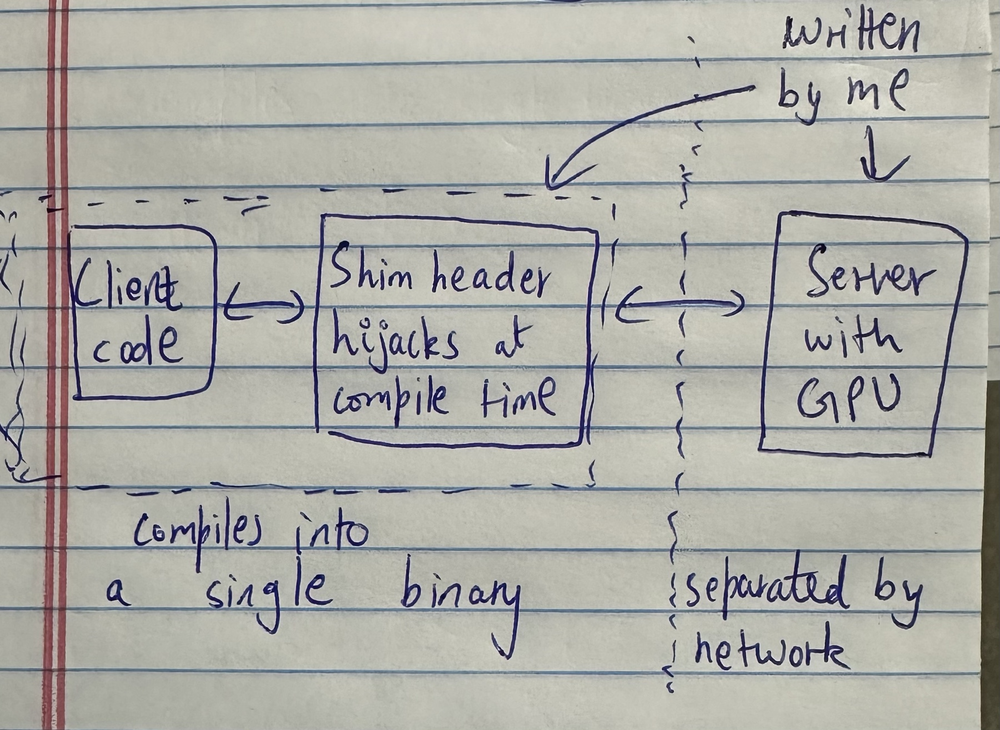
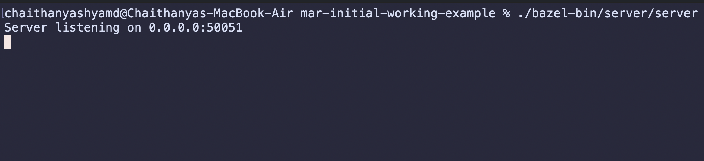
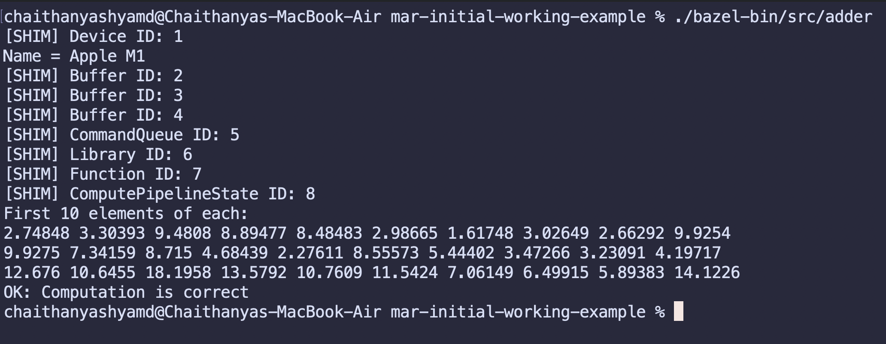
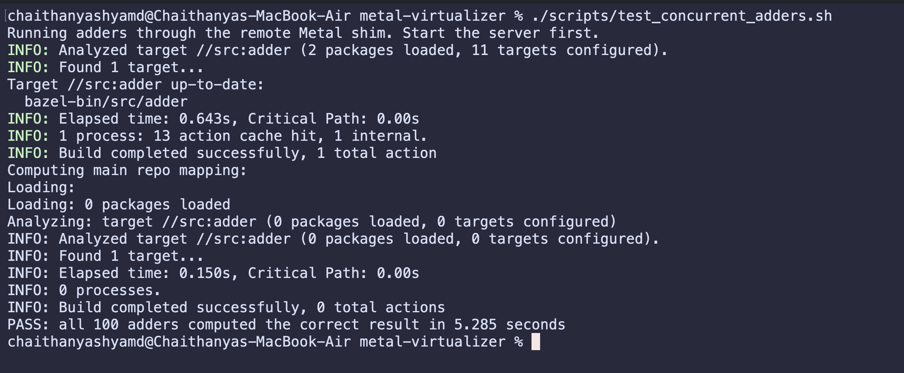

# Metal API Remoter (MAR): turning Apple’s local GPU API into a network protocol

## Motivation

I've said this before and I'll say it again. Compared to my experience in corporate, Grad school is a very interesting place to be in. You meet people from many walks of life and people who will transition to all other walks of life. You get a glimpse into an area that you would never have had the opportunity to know about as compared to a static workplace. 

<!-- more -->

Anyways, One of my friends introduced me to a very interesting startup from Georgia Tech (#GoJackets! :bee:) called [ThunderCompute](https://www.thundercompute.com). They are riding the AI wave and are selling cheap GPU compute. Possibly the cheapest I have ever found so far (?!). The closest I have seen are spot instances given by AWS/GCP/Azure but those are quite risky to run ML workloads since they can be terminated at the providers will. 

I was very curious as to how they could possibly offer such low GPU prices with these features:

1. on-demand
2. sole-tenancy 
3. No forced preemption

How could they be offering a price cheaper than the big cloud players? What are they doing different?

The simple answer is: Oversubscription :stars:

Fascinated by all this, I decided to make my own GPU-over-TCP but since I'm constrained to my dusty 6-year old Macbook air with M1 chip with a single GPU, I have to make several changes to what TNR does.

## Oversubscription

What does what mean? Basically, you sell an item to a user. Then, when the first user is not using the item, you sell the same item to a different user. 

Oversubscription is actually a pretty common thing. It is literally how banks work, they lend out more money than they actually have. But in a more relevant example, cloud providers also do this.

For example, if you pay for 100GB disk space on your serverless function and you use only 20GB of it, your allocated hardware is maybe oversubscribed to other users. Cloud provider makes a huge saving (which in turn reduces prices) but you still own the right to use your entire 100GB disk space. You gotta be smart enough to keep your utilization % high.

What if happens if every single user decides to utilize 100% of their resources? Idk man what happens if everyone withdrew all their money from the bank? Civilization collapses or sumthing. Just have faith in the [LLN gods](https://en.wikipedia.org/wiki/Law_of_large_numbers) (not a typo) and pray this doesn't happen.

I was very interested how ThuNdeRcompute (TNR) manages to oversubscribe their GPU. The way they do it so simple yet so smart.

For many ML workloads, the process stops using the GPU which leads to lot of GPU idle time. For example, if you paid for 1hr of GPU time and only used the GPU for 20 minutes then much of that GPU's capacity remains idle because its allocated solely to you.

What if you could run that GPU on a different ML workload that someone else is waiting on? That would be nice but we can't do that since the GPU is literally attached to the CPU that the first user is doing. Oh, but then what if we detach the GPU and make it remote? That way could pool GPU jobs from different users and schedule them as we want. Perhaps connect the CPU and GPU via an network protocol? Yeah let's do this and call it GPU-over-TCP :absolute-cinema:

So basically, they intercept your code's GPU CUDA calls, forward them over the network via TCP to a real GPU, compute it there, give back the result via TCP again. Sounds simple but insanely hard to achieve. But once you are able to do it, you can oversubscribe your GPUs and make compute cheap and everyone wins!

The obvious downsides are:

-  _Network latency & throughput_: Moving data from CPU to GPU via PCIe/NVLink bus is faster and has more throughput than TCP.
-  Not suitable for _all_ workloads: The TNR economics works by identifying GPU idleness and exploiting it. However, if your workload has the GPU running all the time (for example calculating hashes for a certain reason :hint-hint:) then it's not a particularly useful load for the company.

Btw they also have a student program where you get a free $20 in GPU credits (~9hrs of a H100).

## Hardware & Software Setup

My hardware: 


You might be wondering where the other hardware is located? After all I have to pass data from one device to the other over the network.

Yeah, I can't be bothered to rent out at a cloud apple GPU instance and go through the hassle of setting up the networking for it. I'm just gonna forward the network calls to localhost and have my own device intercept and run its own code lol.

It'll make more sense when you read the next sections but here is the architecture setup:



The software setup:

- C++: This is my favorite language.
- [metal-cpp](https://developer.apple.com/metal/cpp/): An interface that allows me to talk to my GPU in C++.
- [gRPC](https://grpc.io) for networking: Every time I have to pass data via the network, I thank Google for creating gRPC. It handles so much of the RPC plumbing and provides built-in support for serialization, concurrent requests, retries, and its obviously designed to scale.
- [Protocol buffer](https://protobuf.dev) for serialization.
- [Bazel](https://bazel.build) for the build system. Pairs nicely with gRPC and protobuf.
- Shim header: This is 50% of MAR that silently adds a piece code to the user's code that will hijack all their metal calls and convert them to network calls.
- Server code: This is the other 50% of MAR that receives GPU requests via the network and is supposed to schedule, compute and return the result.

## Sample Metal code

I have written a very simple example of adding two arrays using the Apple GPU and I want to remote it. This example is taken from the official [Apple Metal documentation](https://developer.apple.com/documentation/metal/performing-calculations-on-a-gpu). 

The GPU part of the code:

```cpp
#include <metal_stdlib>
using namespace metal;

kernel void add_arrays(device const float* inA,
                       device const float* inB,
                       device float* result,
                       uint index [[thread_position_in_grid]])
{
    result[index] = inA[index] + inB[index];
}
```

The C++ part of the code that runs on CPU (heavily simplified):

```cpp
int main() {
    MTL::Device *device = MTL::CreateSystemDefaultDevice();
    Adder *adder = Adder::create(device);

    adder->prepareData(); // Reads the above metal file and prepares resources for GPU job.
    adder->sendComputeCommand(); // job is sent to GPU and result is waited on. 
    adder->verify(); // Verify that output was correct on CPU.

    // do clean up like releasing resources. 
    return 0;
}
```

The `sendComputeCommand()` is most important so let me add that snippet here.

```cpp
void sendComputeCommand() {
    MTL::CommandBuffer *command_buffer = queue_->commandBuffer();
    MTL::ComputeCommandEncoder *encoder = command_buffer->computeCommandEncoder();

    encodeAddCommand(encoder);

    command_buffer->commit(); // job sent to the GPU asynchronously.

    command_buffer->waitUntilCompleted(); // waiting for GPU to complete.
}
```

You can find the full source code [here](https://github.com/Dragonado/metal-api-remoter/tree/main/src).

## Ominous Premonition

Before remoting the above code, I knew this would be a much harder and different problem to solve than what TNR is doing. 

On first glance, the project seems like a nice idea. Just copy what TNR does but do it for metal-cpp. I can't seem to find anyone else in the world that has done this kind of thing either. Exciting to be the first to build it!

However there are at least two reasons why no one has done this:

1. Apple Metal has no easy interception point for each API call.
2. Apple's Unified Memory architecture allows shared-memory writes that are invisible to the shim.

### 1. Code interception

We have to intercept the client code at some point and forward their GPU calls to the network. This is where TNR and MAR differs.

#### The problem

TNR intercepts CUDA calls at the dynamic load layer. 

They intercept the CUDA references, that are generated during compilation/linking, then make the dynamic loader resolve those references to their custom implementation. They can do this because CUDA has a clean 1:1 mapping of their CUDA functions to C symbols.

Unfortunately, I cannot do this becauase literally almost all the metal calls in cpp are just generic Objective-C object message sends that are resolved at runtime. So there is no 1:1 mapping of GPU function -> symbol for me to intercept and put my own symbol.

It would be extremely laborous and fragile to intercept the generic objective-C call that is resolved at runtime.

Here is the concrete difference. A CUDA Driver API call looks like this:

```cpp
CUdeviceptr buffer;
cuMemAlloc(&buffer, size);
```

`cuMemAlloc` is a C function exported by the CUDA driver library. The compiled program contains a reference to that named function, and the dynamic loader decides which implementation the reference points to. After compilation the function looks like:

```text
$ nm -D client | grep cuMemAlloc
U cuMemAlloc_v2

$ objdump -d client
...
call   cuMemAlloc_v2@plt
```

`U` means the function is undefined inside the client binary: the program expects the dynamic loader to find it in a shared library. Modern CUDA headers map the source-level `cuMemAlloc` call to the ABI-versioned `cuMemAlloc_v2` symbol. The `@plt` is the jump stub through which the final implementation is called.

Now at dynamic-load time, TNR can swap the implementation for this symbol with their own implementation. In fact, [Thunder described exactly this mechanism](../../assets/thunder-compute-ld-preload-job-posting-2026-08-02.png): a userspace shim loaded through `LD_PRELOAD` intercepts CUDA calls and sends them over gRPC.

Basically under the hood:

```text
/etc/ld.so.preload -> /etc/thunder/libthunder.so

client: U cuMemAlloc_v2
client call: cuMemAlloc_v2@plt

normal binding that's not chosen:
  cuMemAlloc_v2 -> libcuda.so.1

Thunder binding that's chosen because of preload:
  cuMemAlloc_v2 -> /etc/thunder/libthunder.so
```

My case is however far more complex.

A typical `metal-cpp` object call instead looks like this:

```cpp
void *data = buffer->contents();
```

The actual inline `metal-cpp` wrapper is effectively this:

```cpp
void *MTL::Buffer::contents() {
    return Object::sendMessage<void *>(this, _MTL_PRIVATE_SEL(contents));
}
```

Now lets look at the compiled code.

```text
$ nm -u client | grep -E 'objc_msgSend|sel_registerName'
_objc_msgSend
_sel_registerName

$ otool -v -s __TEXT __cstring client | grep -A 1 -B 1 contents
000000010001c452  containsAllocation:
000000010001c466  contents
000000010001c46f  controlDependencies
```

The undefined symbol is `_objc_msgSend`, not `_MTLBuffer_contents`. In this metal-cpp build, the word `contents` is stored as a C string and registered as a selector through `_sel_registerName`. At runtime the program passes both the `buffer` object and that selector to the one generic `_objc_msgSend` function.

There is no `_MTLBuffer_contents` function symbol. `contents` is stored separately as an Objective-C selector. On an Apple Silicon Mac, the call is conceptually shaped like this in assembly:

```asm
mov  x0, buffer        ; receiver object
ldr  x1, contents_sel  ; selector: "contents"
bl   _objc_msgSend     ; the one generic dispatch function
```

Like how am I supposed to intercept this bruh?

`setLength`, `newCommandQueue`, `commit`, and thousands of non-Metal Objective-C methods all map to the same `_objc_msgSend` symbol. The object in `x0` and selector in `x1` tell the Objective-C runtime which implementation to execute.

At the dynamic-load layer, there is therefore no separate Metal symbol that I can replace for each method. Intercepting `_objc_msgSend` would catch messages from the entire process, not just Metal.

#### The fix

That is why I substitute my own `MTL::` (`MetalShim::`) namespace while compiling the client instead lmao.

No worry about runtime if I'm literally changing the code written by the user at compile time. The con? I'm changing the code written by the user.

The user may expect their code to be compiled in a certain way but since I'm replacing their MTL:: namespace with my own MetalShim:: namespace, the compiled binary will obviously be different. This is also why unlike TNR, MAR can't work with just binaries, it needs the source code.

I literally have a file that is called [metal_hijack.h](https://github.com/Dragonado/metal-api-remoter/blob/main/metal/metal_hijack.h) that just consists of:

```cpp
#define MTL MetalShim
```

This is interception at compile time.

### 2. Unified Memory

In convential discrete Nvidia GPUs, there is a clear divide between CPU and GPU. In fact, GPUs have their own RAM/cache/memory and stuff. The way the CPU sends data to the GPU is via the PCI Express bus or NVLink that is actually very fast with high throughput.

The `cudaMemcpy` that you usually see in CUDA programs, tell the driver to load and unload data from GPU via some hardware path.

#### The problem

The nice consequence of this is that the programmer conceptually writes their program thinking that CPU and GPU are different entities that need to share data. TNR takes advantage of this model and the only difference (from client POV) is that instead of the hardware path, the data travels via TCP instead.

Its slower for sure but conceptually both are the same.

However, Apple has opted for the unified memory architecture. UMA is a system where the CPU and GPU share a single common pool of physical RAM.

This means the programmer does not need to request an explicit CPU-to-GPU copy. However, I literally create a divide between CPU and GPU and need to transfer data between them. The client CPU and server GPU literally cannot share the same memory because they are in different machines.

This causes a lot of issues for correctness to be resolved.

Here is the simplest example. A conventional discrete-GPU CUDA program explicitly announces when bytes move:

```cpp
cudaMalloc(&gpu_buffer, size); // allocate memory on GPU.
cudaMemcpy(gpu_buffer, cpu_buffer, size, cudaMemcpyHostToDevice); // copy from CPU to GPU.
kernel<<<grid, block>>>(gpu_buffer); // Do work on GPU.
cudaMemcpy(cpu_buffer, gpu_buffer, size, cudaMemcpyDeviceToHost); // copy data from GPU to CPU.
```

A remoter sees both `cudaMemcpy` calls. Each call tells it which bytes moved, how many bytes moved, and the direction they moved in.

With a shared Metal buffer, the CPU can write through a normal pointer:

```cpp
MTL::Buffer *buffer = device->newBuffer(size, MTL::ResourceStorageModeShared);
float *data = static_cast<float *>(buffer->contents());
data[0] = 42.0f; // The CPU has modified this value but the GPU still has access. 
```

That last line is just a CPU memory write. It does not call Metal, so my shim receives no notification that `data[0]` changed. Native Metal does not need one because the CPU and GPU can access the same shared allocation. 

#### The fix

Since my client and server cannot actually share memory, so I compensate by keeping a shadow buffer on the client, copying its bytes to the server at `commit()`, and copying results back after `waitUntilCompleted()`. 

But this requires the programmer to code in a certain way. They have to follow the write-commit-wait-read pattern. So it does not automatically reproduce every asynchronous shared-memory access pattern that native Metal permits.

I'm sure there are many ways to fix it but they are all complicated to implement. I'll take this con of enforcing write->commit->wait->read pattern and live with it for now.


## Turning Metal objects into remote handles

Literally the first thing we do in metal-cpp is create a device handle that represents a GPU which is the below:

```cpp
MTL::Device *device = MTL::CreateSystemDefaultDevice();
```

So device here is pointer that points to some memory 0x123. Clearly it makes no sense to let the client create the device handle and then pass the device pointer to the server. 

So when the client calls this function, we have to have the server mint a new device handle and a mapping of this handle to a `device_id`. The server then passes the `device_id` with some overloaded functions to the client.

So whenver the client then calls a function with the `device` pointer, two things can happen:

1. The function uses the locally stored metadata sent by the server. For example, `device->DeviceName()` is just a string that is stored in the clients memory when the device was first minted by the server.
2. The function makes a network call to the server. For example, `device->newCommandQueue()` needs a new command queue to be minted. So the function calls the server, but then how does the server know which device handle to use? It has many. Thats where the `device_id` comes in handy. The client has identifed that "hey the device handle that is mapped to `device_id` is what you have to use".

Here is the "hijacked" `Device` class that the client recieves:

```cpp
namespace MTLShim {
class Device {
  public:
    Device(uint32_t device_id, NS::String *device_name) : device_id_(device_id), device_name_(device_name) {
        device_name_->retain();
    }

    ~Device() {
        device_name_->release();
    }

    // local calls.
    NS::String *name();
    uint32_t device_id();

    // network calls.
    CommandQueue *newCommandQueue();
    ComputePipelineState *newComputePipelineState(const Function *func, NS::Error **error);
    Library *newLibrary(const NS::String *source, const CompileOptions *options, NS::Error **error);
    Buffer *newBuffer(NS::UInteger length, MTL::ResourceOptions options);


    void release();

  private:
    uint32_t device_id_;
    NS::String *device_name_;
};
}
```

and this is what the server code for minting a device looks like:

```cpp
Status CreateSystemDefaultDeviceShim(ServerContext *context, const CreateSystemDefaultDeviceShimRequest *request, CreateSystemDefaultDeviceShimResponse *response) override {
        MTL::Device *device;
        device = MTL::CreateSystemDefaultDevice();
        if (device == nullptr) {
            return Status(StatusCode::INTERNAL, "Could not create metal device.");
        }

        counter_++;
        device_map_[counter_] = device;
        response->set_device_id(counter_);
        response->set_device_name(device->name()->cString(NS::UTF8StringEncoding));

        return Status::OK;
    }
```

You can find the source code [here](https://github.com/Dragonado/metal-api-remoter/blob/main/metal/metal_shim.h). 

### Rebuilding Metal's object graph with IDs

But we have many Metal objects, not just `Device`. We have objects for command queues, buffers, libraries, functions, compute pipelines states, etc,.

All of them need to be minted by the server and then linked by an ID.

The heirarchy looks something like:

```text
Device ID
├── CommandQueue ID
├── Buffer ID
└── Library ID
    └── Function ID
        └── ComputePipelineState ID
```

## Which calls cross the network?

### Creation and server-state queries

Any method that creates a real Metal object has to cross the network immediately. For example, `device->newCommandQueue()` sends the `device_id` to the server, which looks up the real device, creates a real `MTL::CommandQueue`, stores it, and returns a new `command_queue_id`. The client cannot continue until it gets that ID, so creation RPCs have to be blocking synchronous network calls.

Queries are different. Stable properties such as `device->name()` and a pipeline's maximum thread count are returned when the object is created and cached in the client proxy. Querying them later is then just a local function call. State that cannot be cached would still need an RPC.

### Recording commands locally

Most compute-encoder calls do not need an immediate answer from the GPU. Calls such as `setComputePipelineState`, `setBuffer`, and `dispatchThreads` only describe work that will happen in the future. MAR therefore records the pipeline ID, buffer IDs, offsets, argument indices, and dispatch sizes inside the local encoder proxy.

Sending one RPC for every encoder call would be insanely chatty. Recording locally lets the client build the whole command and ship it in one request at `commit()`.

### client -> server flow

The rule ended up looking like this:

| Method type | Client behavior | Network behavior |
| --- | --- | --- |
| Create device, queue, buffer, library, function, or pipeline | Call server and construct a proxy from the returned ID | Synchronous RPC |
| Read cached metadata | Return the value stored in the proxy | No RPC |
| Record encoder state | Store IDs and dispatch metadata locally | No RPC |
| `commit()` | Send the complete recorded command and buffer snapshots | Synchronous RPC, but does not wait for the GPU |
| `waitUntilCompleted()` | Wait and copy completed bytes into client buffers | Synchronous blocking RPC |
| `release()` | Delete the corresponding server handle | Synchronous RPC |

At `commit()`, the client sends the command-queue ID, pipeline-state ID, grid sizes, buffer IDs, offsets, shader argument indices, and all bound buffer bytes. The server returns a newly minted `command_buffer_id` that the client can later pass to `waitUntilCompleted()`.

### Executing the real Metal command buffer on the server

The serves does this directly inside the `CommitCommandBuffer` RPC. It looks up the real queue, pipeline, and buffers, creats a native Metal command buffer and compute encoder, copies the packed input bytes into the real buffers, restors every buffer binding, and calls the real `dispatchThreads()` and `commit()`.

It then stores the native command-buffer pointer in `command_buffer_map_` under a new ID and returned that ID to the client. There is no job state machine, scheduler thread, or completion callback yet. The RPC simply submitted the work to Metal and returned. The future section will have why it's necessary to have these things when scaling.

### Server -> client flow

`waitUntilCompleted()` sends the `command_buffer_id` back to the server. The initial handler looked up the native pointer in `command_buffer_map_` and directly called Metal's `command_buffer->waitUntilCompleted()`. The gRPC handler stayed blocked until the GPU work finished.

The server then concatenates the contents of the real buffers into the response. The client splits those bytes using the known buffer lengths and copies them into its shadow buffers. From the original program's point of view, the same pointers returned by `Buffer::contents()` now contained the GPU's results.

So after `waitUntilCompleted()` the client buffers and server buffers are in sync!

### Protocol Buffer definitions

gRPC uses protobuf as its serialization format. So the below is my definition of (request, response, rpc) triplet that is needed for every API.

```proto
syntax = "proto3";
package metal_remote;

service MetalRemoteService {
  rpc CreateSystemDefaultDeviceShim(CreateSystemDefaultDeviceShimRequest) returns (CreateSystemDefaultDeviceShimResponse);
  rpc ReleaseDeviceShim(ReleaseDeviceShimRequest) returns (ReleaseDeviceShimResponse);
  rpc CreateCommandQueueShim(CreateCommandQueueShimRequest) returns (CreateCommandQueueShimResponse);
  rpc ReleaseCommandQueueShim(ReleaseCommandQueueShimRequest) returns (ReleaseCommandQueueShimResponse);
  rpc CreateLibraryShim(CreateLibraryShimRequest) returns (CreateLibraryShimResponse);
  rpc ReleaseLibraryShim(ReleaseLibraryShimRequest) returns (ReleaseLibraryShimResponse);
  rpc CreateFunctionShim(CreateFunctionShimRequest) returns (CreateFunctionShimResponse);
  rpc ReleaseFunctionShim(ReleaseFunctionShimRequest) returns (ReleaseFunctionShimResponse);
  rpc CreateComputePipelineStateShim(CreateComputePipelineStateShimRequest) returns (CreateComputePipelineStateShimResponse);
  rpc ReleaseComputePipelineStateShim(ReleaseComputePipelineStateShimRequest) returns (ReleaseComputePipelineStateShimResponse);
  rpc CreateBufferShim(CreateBufferShimRequest) returns (CreateBufferShimResponse);
  rpc ReleaseBufferShim(ReleaseBufferShimRequest) returns (ReleaseBufferShimResponse);
  rpc CommitCommandBuffer(CommitCommandBufferRequest) returns (CommitCommandBufferResponse);
  rpc WaitUntilCompleted(WaitUntilCompletedRequest) returns (WaitUntilCompletedResponse);
}

message CreateSystemDefaultDeviceShimRequest {}

message CreateSystemDefaultDeviceShimResponse {
  uint32 device_id = 1;
  string device_name = 2;
}

// .... many more request,response definitions.
```

Full source code can be found [here](https://github.com/Dragonado/metal-api-remoter/blob/main/proto/metal_remote.proto).

## Initial working example!

At this point the original vector-adder runs end to end through MAR: the client created proxy objects, recorded the command locally, sent it through gRPC, executed it using real Metal on the server, copied the result back, and passed the same correctness check as the native program.

I have successfully remoted this call and theoretically speaking I can run this code on my laptop, have the GPU work be completed on another machine, and get back the result in mine! There would only be network configurations to achieve this.

The server listening for remote Metal calls:



The client running (after the server is live ofc):



Great success!

### But does it scale? Hell Nah

One small problem tho: My code literally cannot handle more than 1 client at a time (which sort of defeats the purpose of this whole project innit?)

This implementation has two obvious multi-client problems.

1.  Without synchronization, concurrent RPC handlers could race while incrementing stateful objects `counter_` or reading and writing the handle maps. For example, 1 thread would read and increment the value of `device_id` while the other thread still reads the old `device_id` value. This would map the same `device_id` to two different handles which is disastrous.
2. Putting one giant lock around every handler prevents those races, but holding that lock while waiting for the GPU serializes the entire things. Client B cannot even enqueue ready work while client A is blocked in a completely unrelated RPC.

The solution to this is, yet again, **STATE MACHINES**! I encountered this same problem in my [previous blog](https://www.chaithu.in/blog/2026/05/15/the-simple-task-of-hosting-an-api/#4-epoll-non-blocking-io) and now much more prepared for multi-threading and state machines.

### My beautiful Stateful machine

Now that we queue jobs, we need a way to find to define what kind of state the job can be in.

```cpp
enum class JobState {
    NOT_STARTED,
    QUEUED,
    RUNNING,
    COMPLETED,
    FAILED,
};

struct Job {
    uint32_t command_buffer_id;
    CommitCommandBufferRequest request;
    MTL::CommandBuffer *command_buffer = nullptr;
    JobState state = JobState::NOT_STARTED;

    Status failure_status;
    std::condition_variable completed_cv; // tells the caller to wait until its completed.
};
```

We of course need to add mutex and server_shutdown for our server.

```cpp
  //....
  private:
    std::atomic<uint32_t> counter_;
    std::mutex mtx_; // efficiency can be improved if we used mutliple mutexes.
    std::condition_variable scheduler_cv_;

    std::deque<std::shared_ptr<Job>> ready_jobs_;
    std::map<uint32_t, std::shared_ptr<Job>> job_map_;

    // This is the main thread that waits to recieve jobs and schedules them to Metal according to its algo.
    std::thread scheduler_thread_;

    // A way to communicate with all threads that server needs to shutdown.
    bool is_server_shutdown;

    // All below map accesses happen within the mutex.
    std::map<uint32_t, MTL::ComputePipelineState *> compute_pipeline_state_map_;
    std::map<uint32_t, MTL::Function *> function_map_;
    std::map<uint32_t, MTL::Library *> library_map_;
    std::map<uint32_t, MTL::CommandQueue *> command_queue_map_;
    std::map<uint32_t, MTL::Buffer *> buffer_map_;
    std::map<uint32_t, MTL::Device *> device_map_;
};
```

Of course this just the setup. Every RPC now needs to be modified to write race-free code using the mutex and conditional variables.

Most of them are boring changes but the scheduler thread is most interesting to me. Here it is:

```cpp
// Dedicated thread to schedule GPU jobs.
void scheduler_loop() {
    while (true) {
        std::unique_lock<std::mutex> lock(mtx_);
        scheduler_cv_.wait(lock, [&]() { return is_server_shutdown || !ready_jobs_.empty(); });

        if (is_server_shutdown)
            break;

        // CURRENT SCHEDULING LOGIC: FIFO
        auto job = *ready_jobs_.begin();
        ready_jobs_.pop_front();

        job->state = JobState::RUNNING;

        lock.unlock();
        commit_job(job);
    }
}
```

### Scheduling constraints

Now we have a new problem to solve. Suppose the scheduler has `N` jobs in its queue. Which one does it choose to dispatch to the GPU?

You can have infinite complexity here and optimise for many things like time, cost, efficiency, etc,. However there is an invariant that all scheduling algorithms must follow to maintain correctneess!

The ordering invariant is simple: suppose the client commits command buffer `c1` before `c2`. If both came from the same command queue, the server must submit `c1` before `c2`. Jobs from different queues have no ordering dependency.

Consider this example:

```cpp
int x = 5;

// c1: write the value 42 into buffer x.
c1 = queue->commandBuffer();
c1->encode(write_42_into(x));
c1->commit();

// c2: read x and copy it into output.
c2 = queue->commandBuffer();
c2->encode(copy(x, output));
c2->commit();
```

Clearly c1 must run before c2 or else the `output` will be `5` instead of `42`.

The simplest algo that statisfies this constraint is First-In-First-Out (FIFO) lol.

### The 100-client race-condition experiment

Writing a race-free multithreaded program for a big project like this is obviosuly challenging. My first attempt was riddled with bugs. I asked Codex to make a script that spawns 100 invocations of my adder program at the same time. I won't describe them here in detail but this one script helped me find so many race conditions in my program.

Most notable:

- Classic example: `counter_++` is obviously not an atomic operation. It is load, increment & store.
- Reading from `std::map` while another thread writes to it is undefined behaviour.
- Server shutdown had a classic lost-wakeup bug. I would notify the scheduler thread to shutdown but the scheduler would be doing some work at the time and ignore the notification since it wouldnt be on the conditional variable.

After fixing all bugs, the 100 clients completed and verified their results!

You can find the script [here](https://github.com/Dragonado/metal-api-remoter/blob/main/scripts/test_concurrent_adders.sh).

## Final Working demo



Absolute Victory!

## Caveats and pitfalls faced

Some caveats of MAR that won't generalize to all metal programs:

- Limited API coverage: MAR implements only the compute methods required by the demo, not the entire Metal API.
- Buffer copies: Every commit and wait currently transfers each bound buffer in full, even if only a few bytes changed.
- Snapshot coherence: The server only observes buffer contents at commit() and after waitUntilCompleted(). CPU writes made while GPU work is running cannot be reproduced correctly because the buffers are not in sync.
- Object lifetime issues: Client buffer proxies must survive until wait, and queued jobs do not yet retain server resources exactly like native Metal.

These limitations are accepted MVP boundaries, not claims of production GPU virtualization. I will not be resolving anytime soon (or ever?).

Pitfalls faced:

- gRPC runs handlers concurrently but that does not make the service object's maps, counters, or queues thread-safe. You have to manage those yourself.
- One global lock can remove data races while accidentally serializing the entire server if it is held during a GPU wait. But this is a very brute-force approach that essentially acts single-threaded.
- A condition-variable notification has no memory. A thread only recieves the notification if it is explicitly waiting for it, otherwise it gets missed.
- Parallel programming is hard. It requires multi-threading, explicit ownership, job states, completion signaling, and cleanup.

At the end of the day, API compatibility means preserving observable behavior. Under the hood we can do whatever we want tbh. The user doesn't care as long is it works correctly and works fast enough.


## Closing remarks

What started as "hey this is an interesting company, how are they doing this?" turned into an awesome systems project about dynamic dispatch, remote object identity, reconstructing transfers from unified memory, and concurrent command scheduling. I'm glad I jumped in this rabbit hole and I learnt a lot.

What I have right now is definitely not some production grade Metal API remoter. It is simply a working proof that a useful subset of `metal-cpp` can be turned into a network protocol without changing the application's Metal calls.
