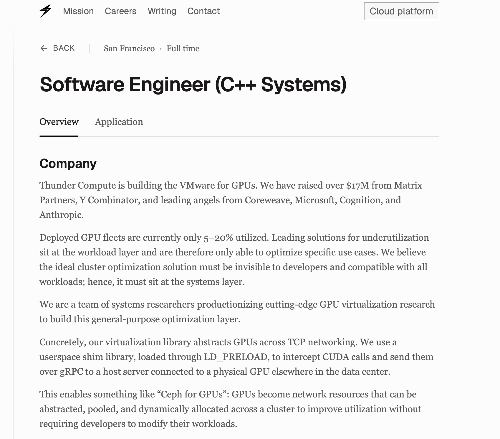

# Metal API Remoter (MAR): turning Apple’s local GPU API into a network protocol

## Motivation

I've said this before and I'll say it again. Compared to my experience in corporate, Grad school is a very interesting place to be in. You meet people from many walks of life and people who will transition to all other walks of life. You get a glimpse into an area that you would never have had the opportunity to know about as compared to a static workplace. 

<!-- more -->

Anyways, One of my friends introduced me to a very interesting startup from Georgia Tech (#GoJackets! :bee:) called [ThunderCompute](https://www.thundercompute.com). They are riding the AI wave and are selling cheap GPU compute. Possibly the cheapest I have ever found so far (?!). The closest I have seen are spot instances given by AWS/GCP/Azure but those are quite risky to run ML workloads since they can be terminated at the providers will. 

I was very curious as to how they could possibly offer such low GPU prices with these features:

1. on-demand
2. sole-tenancy 
3. No forced preemption

How could they be offering a price cheaper than the big cloud players? What are they doing different?

The simple answer is: Oversubscription :stars:

Fascinated by all this, I decided to make my own GPU-over-TCP but since I'm constrained to my dusty 6-year old Macbook air with M1 chip with a single GPU, I have to make several changes to what TNR does.

## Oversubscription

What does what mean? Basically, you sell an item to a user. Then, when the first user is not using the item, you sell the same item to a different user. 

Oversubscription is actually a pretty common thing. It is literally how banks work, they lend out more money than they actually have. But in a more relevant example, cloud providers also do this.

For example, if you pay for 100GB disk space on your serverless function and you use only 20GB of it, your allocated hardware is maybe oversubscribed to other users. Cloud provider makes a huge saving (which in turn reduces prices) but you still own the right to use your entire 100GB disk space. You gotta be smart enough to keep your utilization % high.

What if happens if every single user decides to utilize 100% of their resources? Idk man what happens if everyone withdrew all their money from the bank? Civilization collapses or sumthing. Just have faith in the [LLN gods](https://en.wikipedia.org/wiki/Law_of_large_numbers) (not a typo) and pray this doesn't happen.

I was very interested how ThuNdeRcompute (TNR) manages to oversubscribe their GPU. The way they do it so simple yet so smart. For most ML workloads, the GPU is idle a lot of the time. 

What if you could run that GPU on a different ML workload that someone else is waiting on? That would be nice but we can't do that since the GPU is literally attached to the CPU that the first user is doing. Oh, but then what if we detach the GPU and make it remote? That way could pool GPU jobs from different users and schedule them as we want. Perhaps connect the CPU and GPU via an network protocol? Yeah let's do this and call it GPU-over-TCP :absolute-cinema:

So basically, they intercept your code's GPU CUDA calls, forward them over the network via TCP to a real GPU, compute it there, give back the result via TCP again. Sounds simple but insanely hard to achieve. But once you are able to do it, you can oversubscribe your GPUs and make compute cheap and everyone wins!

The obvious downsides are:

-  _Network latency & throughput_: Moving data from CPU to GPU via PCIe/NVLink bus is faster and has more throughput than TCP.
-  Not suitable for _all_ workloads: The TNR economics works by identifying GPU idleness and exploiting it. However, if your workload has the GPU running all the time (for example calculating hashes for a certain reason :hint-hint:) then it's not a particularly useful load for the company.

Btw they also have a student program where you get a free $20 in GPU credits (~9hrs of a H100).

## Hardware & Software Setup

My hardware: 


You might be wondering where the other hardware is located? After all I have to pass data from one device to the other over the network.

Yeah, I can't be bothered to rent out at a cloud apple GPU instance and go through the hassle of setting up the networking for it. I'm just gonna forward the network calls to localhost and have my own device intercept and run its own code lol.

It'll make more sense when you read the next sections but here is the architecture setup:


The software setup:

- C++: This is my favorite language.
- [metal-cpp](https://developer.apple.com/metal/cpp/): An interface that allows me to talk to my GPU in C++.
- [gRPC](https://grpc.io) for networking: Every time I have to pass data via the network, I thank Google for creating gRPC. It handles so much of the RPC plumbing and provides built-in support for serialization, concurrent requests, retries, and its obviously designed to scale.
- Shim header: This is 50% of MAR that silently adds a piece code to the user's code that will hijack all their metal calls and convert them to network calls.
- Server code: This is the other 50% of MAR that receives GPU requests via the network and is supposed to schedule, compute and return the result.

## Sample Metal code

I have written a very simple example of adding two arrays using the Apple GPU and I want to remote it. This example is taken from the official [Apple Metal documentation](https://developer.apple.com/documentation/metal/performing-calculations-on-a-gpu). 

The GPU part of the code:

```metal
#include <metal_stdlib>
using namespace metal;

kernel void add_arrays(device const float* inA,
                       device const float* inB,
                       device float* result,
                       uint index [[thread_position_in_grid]])
{
    result[index] = inA[index] + inB[index];
}
```

The C++ part of the code that runs on CPU (heavily simplified):

```cpp
int main() {
    MTL::Device *device = MTL::CreateSystemDefaultDevice();
    Adder *adder = Adder::create(device);

    adder->prepareData(); // Reads the above metal file and prepares resources for GPU job.
    adder->sendComputeCommand(); // job is sent to GPU and result is waited on. 
    adder->verify(); // Verify that output was correct on CPU.

    // do clean up like releasing resources. 
    return 0;
}
```

The `sendComputeCommand()` is most important so let me add that snippet here.

```cpp
void sendComputeCommand() {
    MTL::CommandBuffer *command_buffer = queue_->commandBuffer();
    MTL::ComputeCommandEncoder *encoder = command_buffer->computeCommandEncoder();

    encodeAddCommand(encoder);

    command_buffer->commit(); // job sent to the GPU asynchronously.

    command_buffer->waitUntilCompleted(); // waiting for GPU to complete.
}
```

You can find the full source code [here](https://github.com/Dragonado/metal-api-remoter/tree/main/src).

## Ominous Premonition

Before remoting the above code, I knew this would be a much harder and different problem to solve than what TNR is doing. 

On first glance, the project seems like a nice idea. Just copy what TNR does but do it for metal-cpp. I can't seem to find anyone else in the world that has done this kind of thing either. Exciting to be the first to build it!

However there are at least two reasons why no one has done this:

1. Apple Metal has no easy interception point for each API call.
2. Apple's Unified Memory architecture allows shared-memory writes that are invisible to the shim.

### 1. Code interception

We have to intercept the client code at some point and forward their GPU calls to the network. This is where TNR and MAR differs.

#### The problem

TNR intercepts CUDA calls at the dynamic load layer. 

They catch the CUDA references, that are generated after compilation, that calls the GPU and replace it with their own reference. They can do this because CUDA publishes documentation about their [ABI table in their website](https://docs.nvidia.com/cuda/cuda-programming-guide/03-advanced/driver-api.html).

Unfortunately, I cannot do this becauase literally almost all the metal calls in cpp are just generic Objective-C object message sends that are resolved at runtime. So there is no 1:1 mapping of GPU function -> symbol for me to intercept and put my own symbol.

It would be extremely laborous and fragile to intercept the generic objective-C call that is resolved at runtime.

Here is the concrete difference. A CUDA Driver API call looks like this:

```cpp
CUdeviceptr buffer;
cuMemAlloc(&buffer, size);
```

`cuMemAlloc` is a C function exported by the CUDA driver library. The compiled program contains a reference to that named function, and the dynamic loader decides which implementation the reference points to. After compilation the function looks like:

```text
$ nm -D client | grep cuMemAlloc
U cuMemAlloc_v2

$ objdump -d client
...
call   cuMemAlloc_v2@plt
```

`U` means the function is undefined inside the client binary: the program expects the dynamic loader to find it in a shared library. Modern CUDA headers map the source-level `cuMemAlloc` call to the ABI-versioned `cuMemAlloc_v2` symbol. The `@plt` is the jump stub through which the final implementation is called.

Now at dynamic-load time, TNR can swap the implementation for this symbol with their own implementation. In fact, Thunder described exactly this mechanism in its C++ Systems job posting: a userspace shim loaded through `LD_PRELOAD` intercepts CUDA calls and sends them over gRPC.



This is the exported symbol that they have for `cuMemAlloc` present in their `libthunder.so` file.

```text
/etc/ld.so.preload → /etc/thunder/libthunder.so
undefined references → resolves to libthunder.so instead of libcuda.so 
cuMemAlloc_v2 symbol -> cuMemAlloc_v2@@LIBTHUNDER instead of cuMemAlloc_v2@@libcuda.so.1
```

My case is however far more complex.

A typical `metal-cpp` object call instead looks like this:

```cpp
void *data = buffer->contents();
```

The actual inline `metal-cpp` wrapper is effectively this:

```cpp
void *MTL::Buffer::contents() {
    return Object::sendMessage<void *>(this, _MTL_PRIVATE_SEL(contents));
}
```

Now lets look at the compiled code.

```text
$ nm -u client | grep -E 'objc_msgSend|sel_registerName'
_objc_msgSend
_sel_registerName

$ otool -v -s __TEXT __cstring client | grep -A 1 -B 1 contents
000000010001c452  containsAllocation:
000000010001c466  contents
000000010001c46f  controlDependencies
```

The undefined function is `_objc_msgSend`, not `_MTLBuffer_contents`. In this metal-cpp build, the word `contents` is stored as a C string and registered as a selector through `_sel_registerName`. At runtime the program passes both the `buffer` object and that selector to the one generic `_objc_msgSend` function.

There is no `_MTLBuffer_contents` function symbol. `contents` is stored separately as an Objective-C selector. On an Apple Silicon Mac, the call is conceptually shaped like this in assembly:

```asm
mov  x0, buffer        ; receiver object
ldr  x1, contents_sel  ; selector: "contents"
bl   _objc_msgSend     ; the one generic dispatch function
```

Like how am I supposed to intercept this bruh?

`setLength`, `newCommandQueue`, `commit`, and thousands of non-Metal Objective-C methods all map to the same `_objc_msgSend` symbol. The object in `x0` and selector in `x1` tell the Objective-C runtime which implementation to execute.

At the dynamic-load layer, there is therefore no separate Metal symbol that I can replace for each method. Intercepting `_objc_msgSend` would catch messages from the entire process, not just Metal.

#### The fix

That is why I substitute my own `MTL::` (`MetalShim::`) namespace while compiling the client instead lmao.

No worry about runtime if I'm literally changing the code written by the user at compile time. The con? I'm changing the code written by the user.

The user may expect their code to be compiled in a certain way but since I'm front-running their MTL:: userspace with my own MetalShim:: userspace, the compiled binary will obviously be different. This is also why unlike TNR, MAR can't work with just binaries, it needs the source code.

I literally have a file that is called [metal_hijack.h](https://github.com/Dragonado/metal-api-remoter/blob/main/metal/metal_hijack.h) that just consists of:

```cpp
#define MTL MetalShim
```

This is interception at compile time.

### 2. Unified Memory

In convential discrete Nvidia GPUs, there is a clear divide between CPU and GPU. In fact, GPUs have their own RAM/cache/memory and stuff. The way the CPU sends data to the GPU is via the PCI Express bus or NVLink that is actually very fast with high throughput.

The `cudaMemcpy` that you usually see in CUDA programs, tell the driver to load and unload data from GPU via some hardware path.

#### The problem

The nice consequence of this is that the programmer conceptually writes their program thinking that CPU and GPU are different entities that need to share data. TNR takes advantage of this model and the only difference (from client POV) is that instead of the hardware path, the data travels via TCP instead.

Its slower for sure but conceptually both are the same.

However, Apple has opted for the unified memory architecture. Which means the CPU and GPU share the same RAM and have nothing to transfer between the two. Synchronization is the burden of the programmer.

The programmer would then assume that CPU/GPU can access the same memory and would expect every program of theirs to run in this model. However, I literally create a divide between CPU and GPU and need to transfer data between them. The CPU and GPU literally cannot share the same memory.

This causes a lot of issues for correctness to be resolved.

Here is the simplest example. A conventional discrete-GPU CUDA program explicitly announces when bytes move:

```cpp
cudaMalloc(&gpu_buffer, size); // allocate memory on GPU.
cudaMemcpy(gpu_buffer, cpu_buffer, size, cudaMemcpyHostToDevice); // copy from CPU to GPU.
kernel<<<grid, block>>>(gpu_buffer); // Do work on GPU.
cudaMemcpy(cpu_buffer, gpu_buffer, size, cudaMemcpyDeviceToHost); // copy data from GPU to CPU.
```

A remoter sees both `cudaMemcpy` calls. Each call tells it which bytes moved, how many bytes moved, and the direction they moved in.

With a shared Metal buffer, the CPU can write through a normal pointer:

```cpp
MTL::Buffer *buffer = device->newBuffer(size, MTL::ResourceStorageModeShared);
float *data = static_cast<float *>(buffer->contents());
data[0] = 42.0f; // The CPU has modified this value but the GPU still has access. 
```

That last line is just a CPU memory write. It does not call Metal, so my shim receives no notification that `data[0]` changed. Native Metal does not need one because the CPU and GPU can access the same shared allocation. 

#### The fix

Since my client and server cannot actually share memory, so I compensate by keeping a shadow buffer on the client, copying its bytes to the server at `commit()`, and copying results back after `waitUntilCompleted()`. 

But this requires the programmer to code in a certain way. They have to follow the write-commit-wait-read pattern. So it does not automatically reproduce every asynchronous shared-memory access pattern that native Metal permits.

I'm sure there are many ways to fix it but they are all complicated to implement. I'll take this con of enforcing write->commit->wait->read pattern and live with it for now.

## What this project does and does not do

What this project does not:

- 100% API coverage: For this Proof of Concept I could only write code that covers a small subset of Metal-cpp API methods.
- Render: There is no rendering here whatsoever. That is much harder than compute because we have to take into consideration the window owned by the mac, frame rate, image compression, audio sync, and so many more harder problems.

TODO: Rest of blog.

<!-- lorem ipsum -->

<!-- ### The basic client/server goal -->


<!-- lorem ipsum -->

<!-- ## 2. Why Metal is harder to intercept than CUDA -->

<!-- ### CUDA's C ABI and dynamic-linker boundary -->

<!-- lorem ipsum -->

<!-- ### Metal's Objective-C message dispatch -->

<!-- lorem ipsum -->

<!-- ### Why precompiled Metal binaries are outside the MVP -->

<!-- lorem ipsum -->

<!-- ## 3. The compile-time `metal-cpp` header shim -->

<!-- ### Turning `MTL::` into `MetalShim::` -->

<!-- lorem ipsum -->

<!-- ### What the compiler emits after substitution -->

<!-- lorem ipsum -->

<!-- ### Source compatibility versus binary transparency -->

<!-- lorem ipsum -->

<!-- ## 4. Turning Metal's object graph into remote handles -->

<!-- ### Devices, queues, libraries, functions, and pipelines -->

<!-- lorem ipsum -->

<!-- ### Why object creation is synchronous RPC -->

<!-- lorem ipsum -->

<!-- ### `NS::String*` is data, not a remote GPU object -->

<!-- lorem ipsum -->

<!-- ## 5. Create, record, commit, and wait -->

<!-- ### Creation calls cross the network -->

<!-- lorem ipsum -->

<!-- ### Recording calls stay local -->

<!-- lorem ipsum -->

<!-- ### `commit()` is the serialization boundary -->

<!-- lorem ipsum -->

<!-- ### `waitUntilCompleted()` is the completion boundary -->

<!-- lorem ipsum -->

<!-- ## 6. The pointer problem: shadow buffers and coherence -->

<!-- ### Why `Buffer::contents()` cannot send a pointer over the network -->

<!-- lorem ipsum -->

<!-- ### Client-side shadow allocations -->

<!-- lorem ipsum -->

<!-- ### Copying inputs at commit -->

<!-- lorem ipsum -->

<!-- ### Copying outputs after completion -->

<!-- lorem ipsum -->

<!-- ### The unsupported mid-flight CPU/GPU access pattern -->

<!-- lorem ipsum -->

<!-- ## 7. The protobuf protocol -->

<!-- ### Handles and create/release RPCs -->

<!-- lorem ipsum -->

<!-- ### Encoding a command buffer as metadata and bytes -->

<!-- lorem ipsum -->

<!-- ### How protobuf frames repeated fields and `bytes` -->

<!-- lorem ipsum -->

<!-- ## 8. gRPC is parallel: protecting shared server state -->

<!-- ### The 100-client race-condition experiment -->

<!-- lorem ipsum -->

<!-- ### What the mutex actually protects -->

<!-- lorem ipsum -->

<!-- ### Why one global mutex is acceptable for the MVP -->

<!-- lorem ipsum -->

<!-- ### Why the mutex must not cover GPU waits -->

<!-- lorem ipsum -->

<!-- ## 9. The asynchronous command-buffer scheduler -->

<!-- ### RPC handlers enqueue jobs -->

<!-- lorem ipsum -->

<!-- ### One scheduler thread submits to Metal -->

<!-- lorem ipsum -->

<!-- ### FIFO ordering and same-queue dependencies -->

<!-- lorem ipsum -->

<!-- ### Admission order is not GPU preemption -->

<!-- lorem ipsum -->

<!-- ## 10. Resource lifetime across the network boundary -->

<!-- ### Why native Metal retains resources after commit -->

<!-- lorem ipsum -->

<!-- ### The current release-before-wait limitation -->

<!-- lorem ipsum -->

<!-- ### What `PendingJob` must eventually own -->

<!-- lorem ipsum -->

<!-- ## 11. What the working demo proves -->

<!-- ### A vector-add program with the same client source -->

<!-- lorem ipsum -->

<!-- ### Remote execution and result verification -->

<!-- lorem ipsum -->

<!-- ### Concurrent clients sharing one server and GPU -->

<!-- lorem ipsum -->

<!-- ### What has not been measured -->

<!-- lorem ipsum -->

<!-- ## 12. Thunder Compute and TNR: two different tradeoffs -->

<!-- ### Thunder's exclusive GPU-lease model -->

<!-- lorem ipsum -->

<!-- ### This project's command-buffer multiplexing model -->

<!-- lorem ipsum -->

<!-- ### VRAM, fairness, isolation, and predictability -->

<!-- lorem ipsum -->

<!-- ### Why neither design dominates the other -->

<!-- lorem ipsum -->

<!-- ## 13. The semantic contract -->

<!-- ### Preserving Metal meaning, not Metal timing -->

<!-- lorem ipsum -->

<!-- ### The supported-shim boundary -->

<!-- lorem ipsum -->

<!-- ### Honest claims about valid programs and dishonest clients -->

<!-- lorem ipsum -->

<!-- ## 14. What remains -->

<!-- ### Native-compatible resource lifetime -->

<!-- lorem ipsum -->

<!-- ### Broader Metal storage and synchronization modes -->

<!-- lorem ipsum -->

<!-- ### Session isolation and security -->

<!-- lorem ipsum -->

<!-- ### Scheduler instrumentation and utilization experiments -->

<!-- lorem ipsum -->

<!-- ## 15. Closing perspective -->

<!-- ### A working remoter before a production virtual GPU -->

<!-- lorem ipsum -->

<!-- ### The next experiment -->

<!-- lorem ipsum -->
